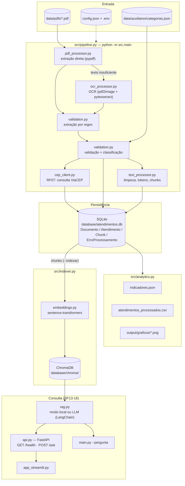
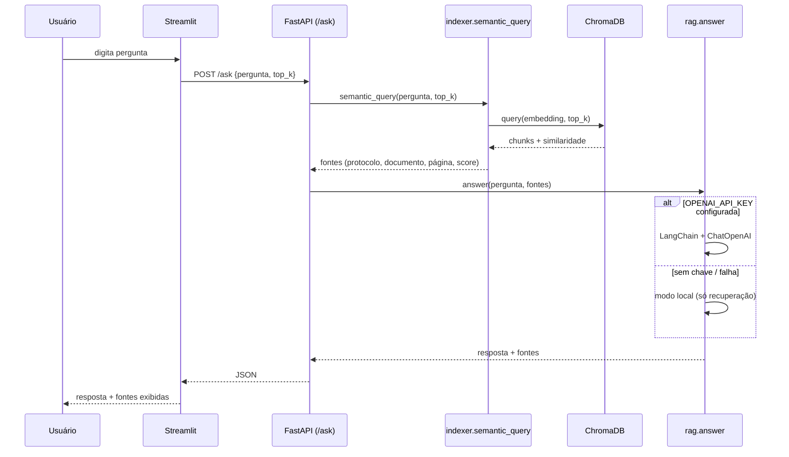

# Arquitetura da aplicação

Diagrama técnico exigido no item 4 dos entregáveis do edital. Renderiza nativamente
no GitHub, GitLab e na extensão Mermaid do VS Code.

## Visão geral do pipeline e das interfaces de consulta

## Camadas e responsabilidades

| Camada | Módulos | Responsabilidade |
|---|---|---|
| Configuração | `config.py` | Carrega `config.json` e segredos de `.env` |
| Extração | `pdf_processor.py`, `ocr_processor.py` | Texto selecionável direto ou via OCR, por página |
| Domínio/validação | `validation.py` | Regex, normalização, classificação em válido/incompleto/inválido/duplicado |
| Enriquecimento | `cep_client.py` | Município/UF via API pública, tolerante a falha |
| Texto/RAG prep | `text_processor.py` | Limpeza, tokenização leve, divisão em chunks com metadados |
| Persistência | `models.py`, `database.py` | SQLAlchemy — 4 tabelas, sessão/transação por documento |
| Indicadores | `analytics.py` | Pandas/NumPy — indicadores, CSV, gráficos |
| Busca semântica | `embeddings.py`, `vector_store.py`, `indexer.py` | Embeddings locais + ChromaDB persistente |
| RAG | `rag.py` | Recuperação + síntese opcional via LangChain/OpenAI, com modo local |
| Interfaces | `api.py`, `app_streamlit.py`, `main.py` | FastAPI, Streamlit, CLI |

## Fluxo de uma pergunta em linguagem natural

